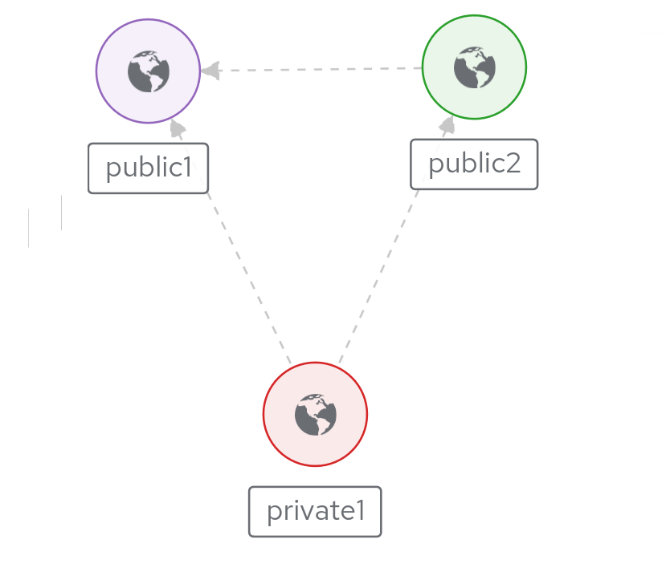
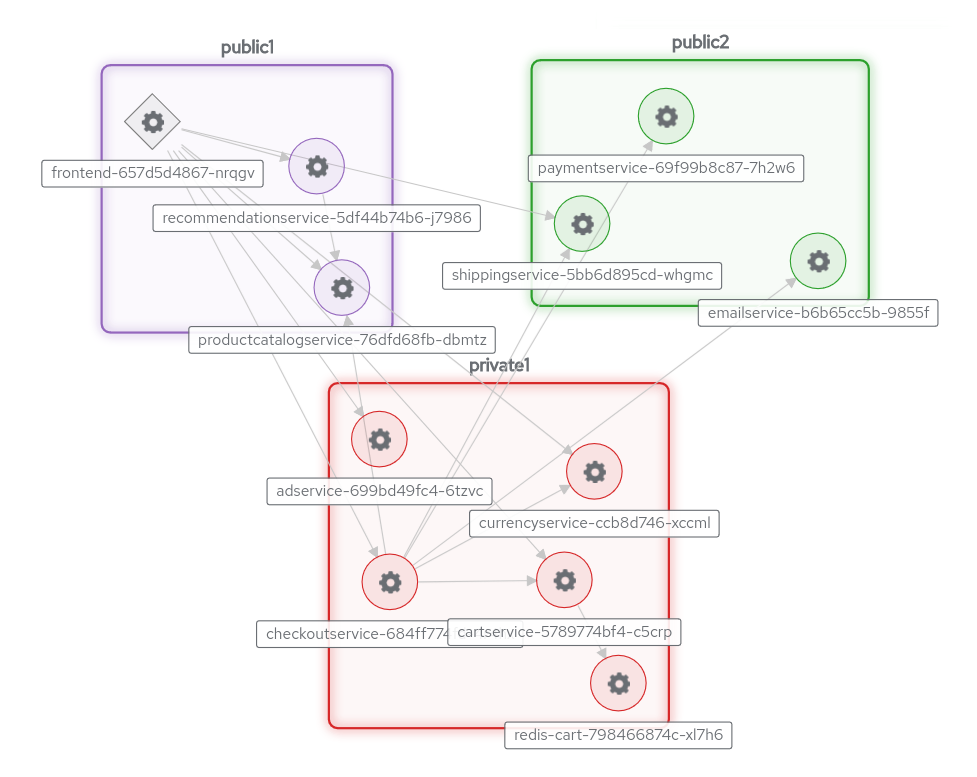

# Skupper Online Boutique

#### A Cloud-Native gRPC microservice-based application deployed across multiple Kubernetes clusters using Skupper

This example is part of a [suite of examples][examples] showing the
different ways you can use [Skupper][website] to connect services
across cloud providers, data centers, and edge sites.

[website]: https://skupper.io/
[examples]: https://skupper.io/examples/index.html

#### Contents

* [Overview](#overview)
* [Prerequisites](#prerequisites)
* [Step 1: Install the Skupper command-line tool](#step-1-install-the-skupper-command-line-tool)
* [Step 2: Configure separate console sessions](#step-2-configure-separate-console-sessions)
* [Step 3: Access your clusters](#step-3-access-your-clusters)
* [Step 4: Set up your namespaces](#step-4-set-up-your-namespaces)
* [Step 5: Install Skupper in your namespaces](#step-5-install-skupper-in-your-namespaces)
* [Step 6: Check the status of your namespaces](#step-6-check-the-status-of-your-namespaces)
* [Step 7: Link your namespaces](#step-7-link-your-namespaces)
* [Step 8: Deploy the application microservices](#step-8-deploy-the-application-microservices)
* [Step 9: Expose the microservices to the Virtual Application Network](#step-9-expose-the-microservices-to-the-virtual-application-network)
* [Step 10: Access The Boutique Shop Application](#step-10-access-the-boutique-shop-application)
* [Step 11: Run the load generator](#step-11-run-the-load-generator)
* [Accessing the web console](#accessing-the-web-console)
* [Cleaning up](#cleaning-up)
* [Summary](#summary)
* [About this example](#about-this-example)

## Overview

This tutorial demonstrates how to deploy the [Online
Boutique](https://github.com/GoogleCloudPlatform/microservices-demo/)
microservices demo application across multiple Kubernetes clusters that are
located in different public and private cloud providers. This project
contains a 10-tier microservices application developed by Google to
demonstrate the use of technologies like Kubernetes.

In this tutorial, you will create a Virtual Application Network that enables
communications across the public and private clusters. You will then deploy a
subset of the application's grpc based microservices to each cluster. You
will then access the `Online Boutique` web interface to browse items, add
them to the cart and purchase them.

## Prerequisites

* The `kubectl` command-line tool, version 1.15 or later
  ([installation guide][install-kubectl])

* Access to at least one Kubernetes cluster, from [any provider you
  choose][kube-providers]

[install-kubectl]: https://kubernetes.io/docs/tasks/tools/install-kubectl/
[kube-providers]: https://skupper.io/start/kubernetes.html

## Step 1: Install the Skupper command-line tool

The `skupper` command-line tool is the entrypoint for installing
and configuring Skupper.  You need to install the `skupper`
command only once for each development environment.

On Linux or Mac, you can use the install script (inspect it
[here][install-script]) to download and extract the command:

~~~ shell
curl https://skupper.io/install.sh | sh
~~~

The script installs the command under your home directory.  It
prompts you to add the command to your path if necessary.

For Windows and other installation options, see [Installing
Skupper][install-docs].

[install-script]: https://github.com/skupperproject/skupper-website/blob/main/docs/install.sh
[install-docs]: https://skupper.io/install/index.html

## Step 2: Configure separate console sessions

Skupper is designed for use with multiple namespaces, usually on
different clusters.  The `skupper` and `kubectl` commands use your
[kubeconfig][kubeconfig] and current context to select the
namespace where they operate.

[kubeconfig]: https://kubernetes.io/docs/concepts/configuration/organize-cluster-access-kubeconfig/

Your kubeconfig is stored in a file in your home directory.  The
`skupper` and `kubectl` commands use the `KUBECONFIG` environment
variable to locate it.

A single kubeconfig supports only one active context per user.
Since you will be using multiple contexts at once in this
exercise, you need to create distinct kubeconfigs.

Start a console session for each of your namespaces.  Set the
`KUBECONFIG` environment variable to a different path in each
session.

_**Console for private1:**_

~~~ shell
export KUBECONFIG=~/.kube/config-private1
~~~

_**Console for public1:**_

~~~ shell
export KUBECONFIG=~/.kube/config-public1
~~~

_**Console for public2:**_

~~~ shell
export KUBECONFIG=~/.kube/config-public2
~~~

## Step 3: Access your clusters

The procedure for accessing a Kubernetes cluster varies by
provider. [Find the instructions for your chosen
provider][kube-providers] and use them to authenticate and
configure access for each console session.

[kube-providers]: https://skupper.io/start/kubernetes.html

## Step 4: Set up your namespaces

Use `kubectl create namespace` to create the namespaces you wish
to use (or use existing namespaces).  Use `kubectl config
set-context` to set the current namespace for each session.

_**Console for private1:**_

~~~ shell
kubectl create namespace private1
kubectl config set-context --current --namespace private1
~~~

_**Console for public1:**_

~~~ shell
kubectl create namespace public1
kubectl config set-context --current --namespace public1
~~~

_**Console for public2:**_

~~~ shell
kubectl create namespace public2
kubectl config set-context --current --namespace public2
~~~

## Step 5: Install Skupper in your namespaces

The `skupper init` command installs the Skupper router and
controller in the current namespace.  Run the `skupper init` command
in each namespace.

**Note:** If you are using Minikube, [you need to start `minikube
tunnel`][minikube-tunnel] before you install Skupper.

[minikube-tunnel]: https://skupper.io/start/minikube.html#running-minikube-tunnel

_**Console for private1:**_

~~~ shell
skupper init --enable-console --enable-flow-collector
~~~

_**Console for public1:**_

~~~ shell
skupper init
~~~

_**Console for public2:**_

~~~ shell
skupper init
~~~

_Sample output:_

~~~ console
$ skupper init
Waiting for LoadBalancer IP or hostname...
Skupper is now installed in namespace '<namespace>'.  Use 'skupper status' to get more information.
~~~

## Step 6: Check the status of your namespaces

Use `skupper status` in each console to check that Skupper is
installed.

_**Console for private1:**_

~~~ shell
skupper status
~~~

_**Console for public1:**_

~~~ shell
skupper status
~~~

_**Console for public2:**_

~~~ shell
skupper status
~~~

_Sample output:_

~~~ console
Skupper is enabled for namespace "<namespace>" in interior mode. It is connected to 1 other site. It has 1 exposed service.
The site console url is: <console-url>
The credentials for internal console-auth mode are held in secret: 'skupper-console-users'
~~~

As you move through the steps below, you can use `skupper status` at
any time to check your progress.

## Step 7: Link your namespaces

Creating a link requires use of two `skupper` commands in
conjunction, `skupper token create` and `skupper link create`.

The `skupper token create` command generates a secret token that
signifies permission to create a link.  The token also carries the
link details.  Then, in a remote namespace, The `skupper link
create` command uses the token to create a link to the namespace
that generated it.

**Note:** The link token is truly a *secret*.  Anyone who has the
token can link to your namespace.  Make sure that only those you
trust have access to it.

First, use `skupper token create --uses 2` in the `public1` namespace to
generate a token for the other two sites.  Then, use `skupper link
create` in the other sites to create a link. Generate another token in
`public2`, and create a link from `private1`. The resulting network
should look like this.

_**Console for public1:**_

~~~ shell
skupper token create ~/public1.token --uses 2
~~~

_Sample output:_

~~~ console
$ skupper token create ~/public1.token --uses 2
Token written to ~/public1.token
~~~

_**Console for public2:**_

~~~ shell
skupper token create ~/public2.token
skupper link create ~/public1.token
~~~

_Sample output:_

~~~ console
$ skupper token create ~/public2.token
Token written to ~/public2.token

$ skupper link create ~/public1.token
Site configured to link to https://10.109.0.238:8081/cb591b0d-8977-11ee-987c-644bf0127228 (name=link1)
Check the status of the link using 'skupper link status'.
~~~

_**Console for private1:**_

~~~ shell
skupper link create ~/public1.token
skupper link create ~/public2.token
~~~

_Sample output:_

~~~ console
$ skupper link create ~/public1.token
Site configured to link to https://10.109.0.238:8081/cb591b0d-8977-11ee-987c-644bf0127228 (name=link1)
Check the status of the link using 'skupper link status'.

$ skupper link create ~/public2.token
Site configured to link to https://10.108.25.64:8081/ce4095e5-8977-11ee-8641-644bf0127228 (name=link2)
Check the status of the link using 'skupper link status'.
~~~

If your console sessions are on different machines, you may need
to use `sftp` or a similar tool to transfer the token securely.
By default, tokens expire after a single use or 15 minutes after
creation.

## Step 8: Deploy the application microservices

After creating the Virtual Application Network, deploy the grpc based microservices for the `Online Boutique` application. There are three `deployment .yaml` files
labelled *a, b, and c*. These files (arbitrarily) define a subset of the application microservices to deploy to a cluster.

| Deployment           | Microservices
| -------------------- | ---------------------------------------- |
| deployment-ms-a.yaml | frontend, productcatalog, recommendation |
| deployment-ms-b.yaml | ad, cart, checkout, currency, redis-cart |
| deployment-ms-c.yaml | email, payment, shipping                 |

_**Console for public1:**_

~~~ shell
kubectl apply -f ./deployment-ms-a.yaml
~~~

_Sample output:_

~~~ console
$ kubectl apply -f ./deployment-ms-a.yaml
deployment.apps/recommendationservice created
deployment.apps/frontend created
service/frontend created
service/frontend-external created
deployment.apps/productcatalogservice created
~~~

_**Console for private1:**_

~~~ shell
kubectl apply -f ./deployment-ms-b.yaml
~~~

_Sample output:_

~~~ console
$ kubectl apply -f ./deployment-ms-b.yaml
deployment.apps/checkoutservice created
deployment.apps/cartservice created
deployment.apps/currencyservice created
deployment.apps/redis-cart created
deployment.apps/adservice created
~~~

_**Console for public2:**_

~~~ shell
kubectl apply -f ./deployment-ms-c.yaml
~~~

_Sample output:_

~~~ console
$ kubectl apply -f ./deployment-ms-c.yaml
deployment.apps/emailservice created
deployment.apps/paymentservice created
deployment.apps/shippingservice created
~~~

## Step 9: Expose the microservices to the Virtual Application Network

There are three script files labelled *-a, -b, and -c*. These files
expose the services created above to join the Virtual Application
Network. Note that the frontend service is not assigned to the Virtual
Application Network as it is setup for external web access.

| File                    | Deployments
| ----------------------- | ---------------------------------------- |
| expose-deployments-a.sh | productcatalog, recommendation           |
| expose-deployments-b.sh | ad, cart, checkout, currency, redis-cart |
| expose-deployments-c.sh | email, payment, shipping                 |

_**Console for public1:**_

~~~ shell
./expose-deployments-a.sh
~~~

_Sample output:_

~~~ console
$ ./expose-deployments-a.sh
deployment productcatalogservice exposed as productcatalogservice
deployment recommendationservice exposed as recommendationservice
~~~

_**Console for private1:**_

~~~ shell
./expose-deployments-b.sh
~~~

_Sample output:_

~~~ console
$ ./expose-deployments-b.sh
deployment checkoutservice exposed as checkoutservice
deployment cartservice exposed as cartservice
deployment currencyservice exposed as currencyservice
deployment adservice exposed as adservice
deployment redis-cart exposed as redis-cart
~~~

_**Console for public2:**_

~~~ shell
./expose-deployments-c.sh
~~~

_Sample output:_

~~~ console
$ ./expose-deployments-c.sh
deployment emailservice exposed as emailservice
deployment paymentservice exposed as paymentservice
deployment shippingservice exposed as shippingservice
~~~

## Step 10: Access The Boutique Shop Application

The web frontend for the `Online Boutique` application can be accessed
via the *frontend-external* service. In the terminal for the **public1**
cluster, find the external address of the frontend-external service and
open the shop UI in your browser.

_**Console for public1:**_

~~~ shell
echo http://$(kubectl get service frontend-external -o=jsonpath='{.status.loadBalancer.ingress[0].ip}')
~~~

_Sample output:_

~~~ console
$ echo http://$(kubectl get service frontend-external -o=jsonpath='{.status.loadBalancer.ingress[0].ip}')
http://<frontend ip>
~~~

## Step 11: Run the load generator

The `Online Boutique` application has a load generator that creates realistic usage patterns on the website.

In the terminal for the **private1** cluster, deploy the load generator.

_**Console for private1:**_

~~~ shell
kubectl apply -f ./deployment-loadgenerator.yaml
sleep 10 && kubectl logs -f deploy/loadgenerator --tail=0 --follow --limit-bytes 2048
kubectl delete -f ./deployment-loadgenerator.yaml
~~~

_Sample output:_

~~~ console
$ kubectl apply -f ./deployment-loadgenerator.yaml
deployment.apps/loadgenerator created

$ sleep 10 && kubectl logs -f deploy/loadgenerator --tail=0 --follow --limit-bytes 2048
Type     Name                                                                          # reqs      # fails |    Avg     Min     Max    Med |   req/s  failures/s
--------|----------------------------------------------------------------------------|-------|-------------|-------|-------|-------|-------|--------|-----------
GET      /                                                                                 12     0(0.00%) |     29      19      46     28 |    1.20        0.00
GET      /cart                                                                              2     0(0.00%) |     16       9      23     10 |    0.20        0.00
POST     /cart                                                                              4     0(0.00%) |     19      13      28     16 |    0.30        0.00
GET      /product/0PUK6V6EV0                                                                1     0(0.00%) |     11      11      11     11 |    0.00        0.00
...

$ kubectl delete -f ./deployment-loadgenerator.yaml
deployment.apps "loadgenerator" deleted
~~~

## Accessing the web console

Skupper includes a web console you can use to view the application
network.  To access it, use `skupper status` to look up the URL of
the web console.  Then use `kubectl get
secret/skupper-console-users` to look up the console admin
password.

**Note:** The `<console-url>` and `<password>` fields in the
following output are placeholders.  The actual values are specific
to your environment.

_**Console for private1:**_

~~~ shell
skupper status
kubectl get secret/skupper-console-users -o jsonpath={.data.admin} | base64 -d
~~~

_Sample output:_

~~~ console
$ skupper status
Skupper is enabled for namespace "private1". It is connected to 1 other site. It has 1 exposed service.
The site console url is: <console-url>
The credentials for internal console-auth mode are held in secret: 'skupper-console-users'

$ kubectl get secret/skupper-console-users -o jsonpath={.data.admin} | base64 -d
<password>
~~~

Navigate to `<console-url>` in your browser.  When prompted, log
in as user `admin` and enter the password.

## Cleaning up

To remove Skupper and the other resources from this exercise, use
the following commands.

_**Console for public1:**_

~~~ shell
./unexpose-deployments-a.sh
kubectl delete -f ./deployment-ms-a.yaml
skupper delete
~~~

_**Console for private1:**_

~~~ shell
./unexpose-deployments-b.sh
kubectl delete -f ./deployment-ms-b.yaml
skupper delete
~~~

_**Console for public2:**_

~~~ shell
./unexpose-deployments-c.sh
kubectl delete -f ./deployment-ms-c.yaml
skupper delete
~~~

## Summary

This example locates the many services that make up a microservice
application across three different namespaces on different clusters with no
modifications to the application. Without Skupper, it would normally take
careful network planning to avoid exposing these services over the public
internet.

Introducing Skupper into each namespace allows us to create a virtual
application network that can connect services in different clusters. Any
service exposed on the application network is represented as a local service in
all of the linked namespaces.

## Next steps

Check out the other [examples][examples] on the Skupper website.

## About this example

This example was produced using [Skewer][skewer], a library for
documenting and testing Skupper examples.

[skewer]: https://github.com/skupperproject/skewer

Skewer provides utility functions for generating the README and
running the example steps.  Use the `./plano` command in the project
root to see what is available.

To quickly stand up the example using Minikube, try the `./plano demo`
command.
